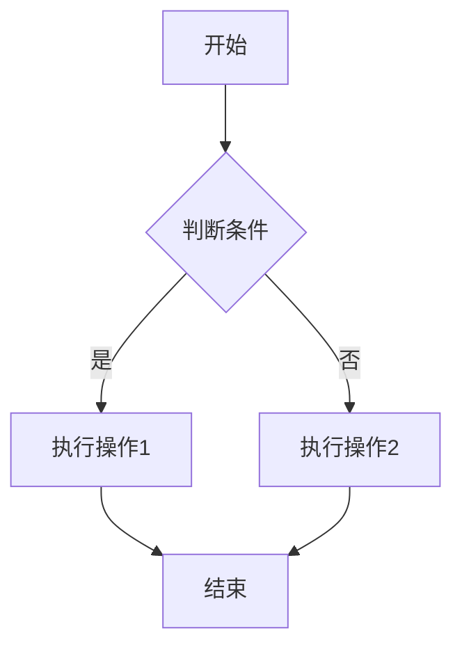
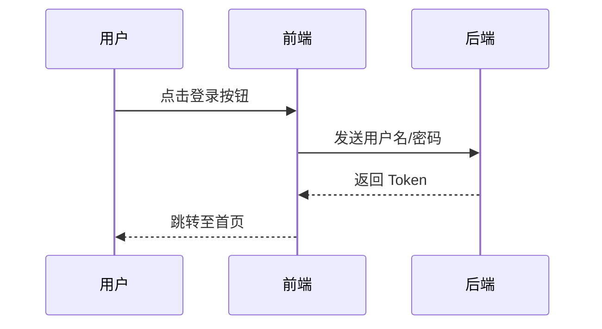
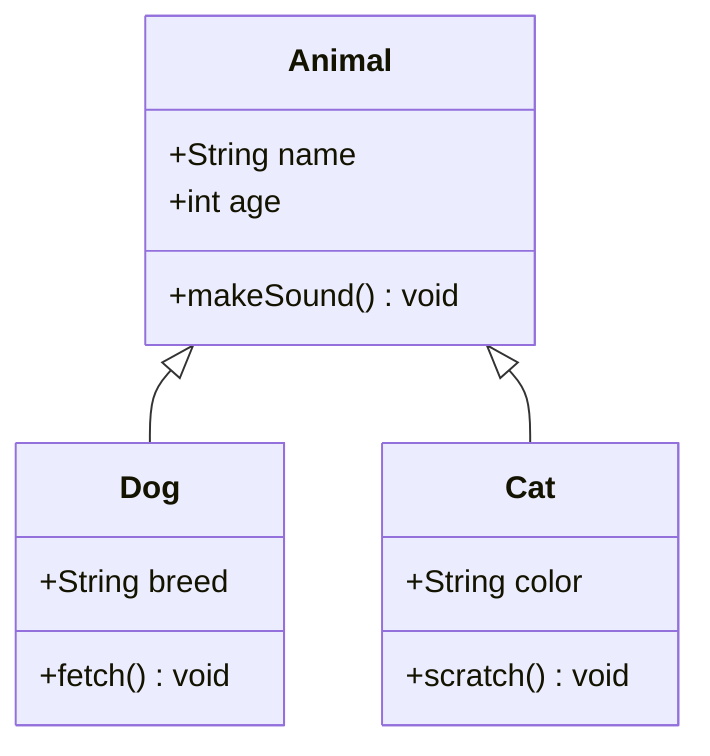
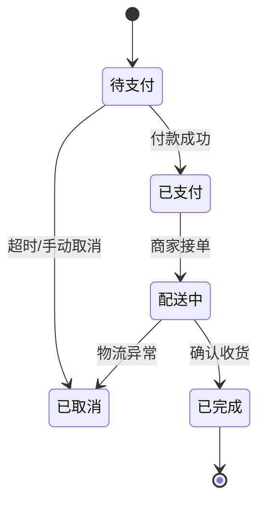
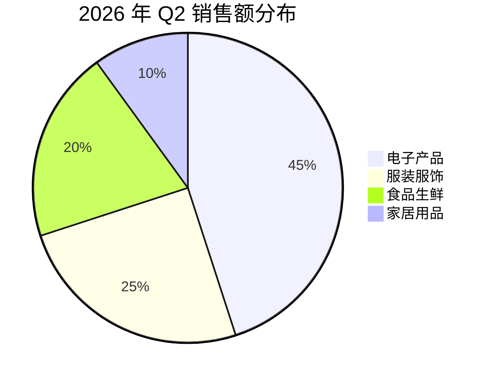
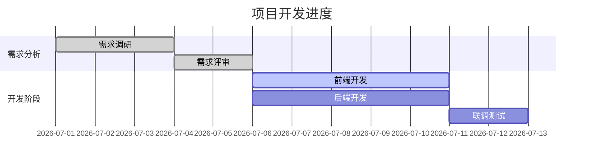

这是一份**终极版 Markdown 语法演示大全**。它不仅覆盖了基础语法与 GFM（GitHub Flavored Markdown）扩展，更**重点补充**了你要求的 **Mermaid 图表**、**LaTeX 数学公式**以及**高亮/标记语法**，并明确区分了核心语法与扩展语法（适用于 Typora、Obsidian、GitHub 等主流平台）。

你可以直接将以下内容保存为 `Markdown-Complete-Demo.md` 并在支持的编辑器中预览。

---

# Markdown 语法完全演示手册（含 Mermaid / Chart.js / 公式 / 高亮）

> **兼容性说明**：标有 ⭐ 的为基础通用语法；标有 🚀 的为扩展语法（GFM / Typora / Obsidian 等支持）。

---

## 📑 目录
1. [文档结构与排版](#1-文档结构与排版)
2. [文字样式与高亮](#2-文字样式-高亮-emoji-与特殊符号)
3. [列表与任务清单](#3-列表与任务清单)
4. [链接、图片与自动识别](#4-链接-图片与自动识别)
5. [代码与代码块（语法高亮）](#5-代码与代码块-语法高亮)
6. [引用块（嵌套与混合）](#6-引用块-嵌套与混合)
7. [表格（对齐与复杂内容）](#7-表格-对齐与复杂内容)
8. [Mermaid 图表大全](#8-mermaid-图表大全-核心亮点)
9. [Chart.js 交互式图表大全](#9-chartjs-交互式图表大全-核心亮点)
10. [LaTeX 数学公式](#10-latex-数学公式-核心亮点)
11. [扩展语法：定义列表 / 脚注 / 缩写](#11-扩展语法-定义列表-脚注-缩写)
12. [HTML 混合与转义字符](#12-html-混合与转义字符)

---

## 1-文档结构与排版

### 1.1 标题（Setext 与 ATX 风格）
一级标题（Setext）
===

二级标题（Setext）
---

### ATX 风格（共六级）
# 一级标题
## 二级标题
### 三级标题
#### 四级标题
##### 五级标题
###### 六级标题

### 1.2 段落与换行 ⭐
这是一个普通段落。段落之间通过空行分隔。

如果要在段落内强制换行，可以在行尾添加**两个空格**后再回车。  
这是第二行（行尾有两个空格）。  
或者直接使用 HTML 的 `<br>` 标签实现换行。<br>这是第三行。

### 1.3 分割线 ⭐
可以使用三个或以上的 `-`、`*` 或 `_` 绘制分割线：

---
***
___

---

## 2. 文字样式 & 高亮 & Emoji 与特殊符号

### 2.1 基础修饰 ⭐
- **加粗**：`**双星号**` 或 `__双下划线__` -> **加粗示例**
- *斜体*：`*单星号*` 或 `_单下划线_` -> *斜体示例*
- ***加粗斜体***：`***三个星号***` -> ***加粗斜体***
- ~~删除线~~：`~~波浪号~~` -> ~~删除线~~
- <u>下划线</u>：HTML 的 `<u>` 标签 -> <u>下划线文本</u>

### 2.2 高亮/标记语法 🚀 (Typora/Obsidian)
使用双等号 `==` 包裹文本实现高亮（类似荧光笔效果）：
- 这是普通的文本，而 `==这是高亮文本==` 效果为：==这是高亮文本==。
- 高亮可以和加粗结合：`==**加粗高亮**==` -> ==**加粗高亮**==

### 2.3 上标与下标 🚀 (GFM / Typora)
- 上标：`X^2^` -> X^2^
- 下标：`H~2~O` -> H~2~O

### 2.4 Emoji 表情 🚀
直接输入或使用简码（需平台支持）：
:smile: :heart: :thumbsup: :rocket: :zap:  
原生表情：😄 ❤️ 👍 🚀 ⚡

---

## 3. 列表与任务清单

### 3.1 无序列表 ⭐
- 使用 `-` 减号
+ 或者 `+` 加号
* 或者 `*` 星号
    - 缩进两个空格形成子列表
        * 再缩进四个空格形成三级

### 3.2 有序列表 ⭐
1. 第一项（数字自动递增）
2. 第二项
3. 第三项
    1. 子项 1（缩进）
    2. 子项 2
4. 即使写错数字（如 99.），渲染也会按顺序排列

### 3.3 任务清单（Todo List） 🚀 (GFM)
- [x] 已完成的任务（点击复选框可勾选）
- [x] 编写 Markdown 文档大纲
- [ ] 审阅 Mermaid 图表部分
- [ ] 发布到线上仓库
    - [x] 子任务 1（已完成）
    - [ ] 子任务 2（待完成）

---

## 4. 链接、图片与自动识别

### 4.1 行内链接与引用链接 ⭐
- 行内：[访问百度](https://www.baidu.com "悬停提示")
- 引用链接：[GitHub][1] 是一个代码托管平台。

[1]: https://github.com "GitHub 首页"

### 4.2 自动链接 ⭐
尖括号包裹的 URL 或邮箱会自动识别：
<https://www.example.com>
<admin@example.com>

### 4.3 图片与点击跳转 ⭐


[](https://www.example.com)

---

## 5. 代码与代码块（语法高亮）

### 5.1 行内代码 ⭐
使用反引号包裹：`print("Hello World")` 是 Python 的打印函数。

### 5.2 围栏代码块（指定语言实现高亮）⭐
使用三个反引号加上语言标识符：

```javascript
// JavaScript 异步示例
const fetchData = async (url) => {
    const response = await fetch(url);
    const data = await response.json();
    console.log(data);
};
fetchData('https://api.example.com');
```

```python
# Python 列表推导式
squares = [x**2 for x in range(10) if x % 2 == 0]
print(f"偶数平方: {squares}")
```

```css
/* CSS 样式 */
.container {
    display: flex;
    justify-content: center;
    background: linear-gradient(135deg, #f5f7fa 0%, #c3cfe2 100%);
}
```

---

## 6. 引用块（嵌套与混合）⭐
> 这是一级引用块，用于强调重要内容。
> 引用块可以跨行，也支持 **加粗**、*斜体* 和 `行内代码`。

> 外层引用
>> 这是嵌套的二级引用（缩进两个 `>`）。
>>> 这是三级引用块（层层递进）。

> #### 引用块内可以包含标题和列表
> - 列表项 1
> - 列表项 2
> 
> 以及代码块：
> ```
> 这是引用内的代码块
> ```

---

## 7. 表格（对齐与复杂内容）⭐

### 7.1 基本表格与对齐
使用 `:` 控制水平对齐方式。

| 左对齐（默认） | 居中对齐 | 右对齐 |
| :--- | :---: | ---: |
| 苹果 | 5.00 元 | 100 克 |
| 香蕉 | 3.50 元 | 150 克 |
| 西瓜 | 20.00 元 | 2000 克 |

### 7.2 表格内换行与样式混合
使用 `<br>` 标签换行，支持行内代码和加粗。

| 列 1（状态） | 列 2（详情） |
| :--- | :--- |
| 成功 ✅ | 第一行内容<br>第二行内容 |
| 待定 ⚠️ | 支持 `行内代码` 和 **加粗文本** |

---

## 8. Mermaid 图表大全（🚀 核心亮点）

> **注意**：Mermaid 需在支持渲染的编辑器（Typora、Obsidian、GitHub Markdown）中预览。将代码块语言指定为 `mermaid`。

### 8.1 流程图（Graph / Flowchart）


### 8.2 时序图（Sequence Diagram）


### 8.3 类图（Class Diagram）


### 8.4 状态图（State Diagram）


### 8.5 饼图（Pie Chart）


### 8.6 甘特图（Gantt Chart）🚀


---

## 9. Chart.js 交互式图表大全（🚀 核心亮点）

> **注意**：Chart.js 图表需在 MDView 预览中渲染。将代码块语言指定为 `chart` 或 `chartjs`，预览时会自动渲染为交互式图表（代码块自动隐藏）。也支持 `javascript`/`js` 语言标签且代码中包含 `new Chart(` 的代码块。

### 9.1 柱状图（Bar Chart）— 各装置季度加工量对比
```chart
new Chart(document.getElementById('chart1'), {
  type: 'bar',
  data: {
    labels: ['常减压装置', '催化裂化装置', '加氢精制装置', '焦化装置', '重整装置'],
    datasets: [
      { label: 'Q1', data: [85, 62, 48, 35, 52], backgroundColor: 'rgba(54, 162, 235, 0.7)', borderRadius: 6 },
      { label: 'Q2', data: [92, 68, 55, 40, 58], backgroundColor: 'rgba(75, 192, 192, 0.7)', borderRadius: 6 },
      { label: 'Q3', data: [88, 71, 52, 38, 55], backgroundColor: 'rgba(255, 206, 86, 0.7)', borderRadius: 6 },
      { label: 'Q4', data: [95, 75, 60, 42, 63], backgroundColor: 'rgba(255, 99, 132, 0.7)', borderRadius: 6 }
    ]
  },
  options: {
    responsive: true,
    maintainAspectRatio: false,
    plugins: {
      title: { display: true, text: '2026年各装置季度加工量（万吨）', font: { size: 16, family: 'Microsoft YaHei' } },
      tooltip: { callbacks: { label: function(ctx) { return ctx.dataset.label + ': ' + ctx.parsed.y + ' 万吨'; } } }
    },
    scales: { y: { beginAtZero: true, title: { display: true, text: '加工量（万吨）' } } }
  }
});
```

### 9.2 折线图（Line Chart）— 月度能耗趋势分析
```chart
new Chart(document.getElementById('chart2'), {
  type: 'line',
  data: {
    labels: ['1月','2月','3月','4月','5月','6月','7月','8月','9月','10月','11月','12月'],
    datasets: [
      { label: '蒸汽（吨）', data: [1200,1180,1320,1400,1550,1680,1750,1720,1600,1480,1350,1280], borderColor: 'rgba(255,99,132,1)', backgroundColor: 'rgba(255,99,132,0.15)', fill: true, tension: 0.4 },
      { label: '电力（万kWh）', data: [850,820,880,920,980,1050,1100,1080,1000,940,880,860], borderColor: 'rgba(54,162,235,1)', backgroundColor: 'rgba(54,162,235,0.15)', fill: true, tension: 0.4 },
      { label: '循环水（万吨）', data: [320,310,340,360,390,410,420,415,390,370,345,330], borderColor: 'rgba(75,192,192,1)', backgroundColor: 'rgba(75,192,192,0.15)', fill: true, tension: 0.4 }
    ]
  },
  options: {
    responsive: true,
    maintainAspectRatio: false,
    plugins: {
      title: { display: true, text: '2026年月度能耗趋势', font: { size: 16, family: 'Microsoft YaHei' } }
    },
    scales: { y: { beginAtZero: false, title: { display: true, text: '能耗值' } } },
    interaction: { mode: 'index', intersect: false }
  }
});
```

### 9.3 环形图（Doughnut Chart）— 能源消耗结构分析
```chart
new Chart(document.getElementById('chart3'), {
  type: 'doughnut',
  data: {
    labels: ['蒸汽', '电力', '循环水', '燃料气', '除盐水'],
    datasets: [{
      data: [35, 28, 18, 12, 7],
      backgroundColor: ['rgba(255,99,132,0.8)','rgba(54,162,235,0.8)','rgba(255,206,86,0.8)','rgba(75,192,192,0.8)','rgba(153,102,255,0.8)'],
      borderColor: ['#fff'],
      borderWidth: 2,
      hoverOffset: 12
    }]
  },
  options: {
    responsive: true,
    maintainAspectRatio: false,
    plugins: {
      title: { display: true, text: '能源消耗结构占比', font: { size: 16, family: 'Microsoft YaHei' } },
      tooltip: { callbacks: { label: function(ctx) { return ctx.label + ': ' + ctx.parsed + '%'; } } }
    }
  }
});
```

### 9.4 雷达图（Radar Chart）— 装置运行状态综合评估
```chart
new Chart(document.getElementById('chart4'), {
  type: 'radar',
  data: {
    labels: ['设备完好率','工艺稳定率','能耗效率','安全合规率','环保达标率','人员技能'],
    datasets: [
      { label: '常减压装置', data: [95,92,88,98,96,90], borderColor: 'rgba(54,162,235,1)', backgroundColor: 'rgba(54,162,235,0.2)', pointRadius: 4 },
      { label: '催化裂化装置', data: [88,85,82,95,93,85], borderColor: 'rgba(255,99,132,1)', backgroundColor: 'rgba(255,99,132,0.2)', pointRadius: 4 },
      { label: '加氢精制装置', data: [92,90,90,97,95,88], borderColor: 'rgba(75,192,192,1)', backgroundColor: 'rgba(75,192,192,0.2)', pointRadius: 4 }
    ]
  },
  options: {
    responsive: true,
    maintainAspectRatio: false,
    plugins: {
      title: { display: true, text: '装置运行状态综合评估（分）', font: { size: 16, family: 'Microsoft YaHei' } }
    },
    scales: { r: { beginAtZero: true, max: 100, ticks: { stepSize: 20 } } }
  }
});
```

### 9.5 混合双Y轴图（Bar + Line）— 产量与能耗联动分析
```chart
new Chart(document.getElementById('chart5'), {
  type: 'bar',
  data: {
    labels: ['1月','2月','3月','4月','5月','6月','7月','8月'],
    datasets: [
      { type: 'bar', label: '原油加工量（万吨）', data: [85,80,88,92,95,98,96,94], backgroundColor: 'rgba(54,162,235,0.6)', borderRadius: 6, yAxisID: 'y' },
      { type: 'line', label: '综合能耗（kg标油/吨）', data: [62,64,60,58,56,55,57,58], borderColor: 'rgba(255,99,132,1)', backgroundColor: 'rgba(255,99,132,0.1)', borderWidth: 3, tension: 0.4, pointRadius: 5, fill: false, yAxisID: 'y1' }
    ]
  },
  options: {
    responsive: true,
    maintainAspectRatio: false,
    plugins: {
      title: { display: true, text: '原油加工量与综合能耗联动分析', font: { size: 16, family: 'Microsoft YaHei' } }
    },
    scales: {
      y: { type: 'linear', position: 'left', title: { display: true, text: '加工量（万吨）' }, beginAtZero: true },
      y1: { type: 'linear', position: 'right', title: { display: true, text: '能耗（kg标油/吨）' }, grid: { drawOnChartArea: false }, beginAtZero: false, min: 40 }
    }
  }
});
```

### 9.6 堆叠柱状图（Stacked Bar）— 各装置维检费用构成
```chart
new Chart(document.getElementById('chart6'), {
  type: 'bar',
  data: {
    labels: ['常减压装置','催化裂化装置','加氢精制装置','焦化装置','重整装置'],
    datasets: [
      { label: '日常维护', data: [120,150,95,80,110], backgroundColor: 'rgba(54,162,235,0.7)', borderRadius: 4 },
      { label: '大修费用', data: [280,320,180,150,220], backgroundColor: 'rgba(255,99,132,0.7)', borderRadius: 4 },
      { label: '备件采购', data: [85,110,65,55,75], backgroundColor: 'rgba(75,192,192,0.7)', borderRadius: 4 },
      { label: '检测检验', data: [45,55,35,30,40], backgroundColor: 'rgba(255,206,86,0.7)', borderRadius: 4 }
    ]
  },
  options: {
    responsive: true,
    maintainAspectRatio: false,
    plugins: {
      title: { display: true, text: '2026年各装置维检费用构成（万元）', font: { size: 16, family: 'Microsoft YaHei' } },
      tooltip: { callbacks: { label: function(ctx) { return ctx.dataset.label + ': ' + ctx.parsed.y + ' 万元'; } } }
    },
    scales: { x: { stacked: true }, y: { stacked: true, beginAtZero: true, title: { display: true, text: '费用（万元）' } } }
  }
});
```

### 9.7 极坐标图（Polar Area）— 科研成果产出统计
```chart
new Chart(document.getElementById('chart7'), {
  type: 'polarArea',
  data: {
    labels: ['发明专利','实用新型','技术论文','技术标准','软件著作权','技术改造'],
    datasets: [{
      data: [12, 28, 18, 8, 6, 22],
      backgroundColor: ['rgba(255,99,132,0.7)','rgba(54,162,235,0.7)','rgba(255,206,86,0.7)','rgba(75,192,192,0.7)','rgba(153,102,255,0.7)','rgba(255,159,64,0.7)'],
      borderWidth: 2,
      borderColor: '#fff'
    }]
  },
  options: {
    responsive: true,
    maintainAspectRatio: false,
    plugins: {
      title: { display: true, text: '2026年科研成果产出统计（项）', font: { size: 16, family: 'Microsoft YaHei' } }
    }
  }
});
```

---

## 10. LaTeX 数学公式（🚀 核心亮点）

> **注意**：公式渲染需编辑器支持 MathJax / KaTeX。行内公式用 `$...$`，块级公式用 `$$...$$`。

### 10.1 行内公式
质能方程：$E = mc^2$ 是物理学中最著名的公式。  
欧拉公式：$e^{i\pi} + 1 = 0$ 被誉为数学中最美的公式。

### 10.2 块级公式（独立成行）
一元二次方程求根公式：
$$
x = \frac{-b \pm \sqrt{b^2 - 4ac}}{2a}
$$

### 10.3 极限与积分
定积分定义：
$$
\int_{0}^{1} x^2 \, dx = \left[ \frac{x^3}{3} \right]_{0}^{1} = \frac{1}{3}
$$

极限表达式：
$$
\lim_{n \to \infty} \left(1 + \frac{1}{n}\right)^n = e
$$

### 10.4 矩阵与大括号
矩阵示例：
$$
\begin{bmatrix}
1 & 2 & 3 \\
4 & 5 & 6 \\
7 & 8 & 9
\end{bmatrix}
\quad \text{与} \quad
\begin{pmatrix}
a & b \\
c & d
\end{pmatrix}
$$

分段函数：
$$
f(x) = \begin{cases}
x^2, & \text{if } x \geq 0 \\
-x, & \text{if } x < 0
\end{cases}
$$

### 10.5 希腊字母与特殊符号
$\alpha$、$\beta$、$\gamma$、$\Delta$、$\Omega$  
求和：$\sum_{i=1}^{n} i^2$；累乘：$\prod_{j=1}^{m} j$。

---

## 11. 扩展语法：定义列表 / 脚注 / 缩写

### 11.1 定义列表 🚀 (Markdown Extra / PHP Markdown Extra)
术语 1
: 这是定义 1 的具体描述，可以包含多行。
: 同一个术语可以有多个定义。

术语 2（如：Markdown）
: 一种轻量级的标记语言，广泛用于格式化文本。

### 11.2 脚注 🚀
这是一个包含脚注的句子[^1]，这里还有一个额外的脚注[^note]。

[^1]: 这是脚注 1 的详细内容，通常放在文档末尾。
[^note]: 这是第二个脚注，支持**加粗**或 `代码` 格式。

### 11.3 缩写 🚀

HTML 和 CSS 是 Web 开发的核心技术。此外，JS 也常用于前端交互。

*[HTML]: 超文本标记语言 (HyperText Markup Language)
*[CSS]: 层叠样式表 (Cascading Style Sheets)
*[JS]: JavaScript

---

## 12. HTML 混合与转义字符

### 12.1 嵌入式 HTML（弥补 Markdown 不足）
<div style="background: #f0f8ff; padding: 15px; border-left: 5px solid #0078d4; border-radius: 4px; margin: 10px 0;">
    <p style="color: #333; font-weight: bold;">📌 提示框：</p>
    <p>这是一个使用 HTML 绘制的自定义信息框，支持 <span style="color: red;">红色</span> 和 <span style="color: blue;">蓝色</span> 文字。</p>
</div>

### 12.2 键盘按键样式
使用 `<kbd>` 标签表示键盘按键：
<kbd>Ctrl</kbd> + <kbd>C</kbd> 复制  
<kbd>Ctrl</kbd> + <kbd>V</kbd> 粘贴  
<kbd>Shift</kbd> + <kbd>Enter</kbd> 软换行

### 12.3 转义字符 ⭐
使用反斜杠 `\` 让特殊符号显示为字面量：

\* 这不是斜体 \*  
\# 这不是标题  
1\. 这不是有序列表  
\[这不是链接\]  

**可转义列表**：`\` ` ` ` ` `*` `_` `{}` `[]` `()` `#` `+` `-` `.` `!` `|`

---

## 🎯 总结

这份文档一次性涵盖了：
- ✅ 100% 通用 Markdown 核心语法
- ✅ GFM 扩展（任务列表、表格、删除线）
- ✅ **Mermaid 图表（流程图、时序、类图、状态、饼图、甘特图）**
- ✅ **Chart.js 交互式图表（柱状图、折线图、环形图、雷达图、混合双Y轴、堆叠图、极坐标图）**
- ✅ **LaTeX 数学公式（行内、块级、矩阵、分段函数）**
- ✅ **高亮标记（==荧光笔==）与上下标**
- ✅ 脚注、定义列表、缩写、Emoji 与 HTML 混合

将其复制到你的本地编辑器，开启实时预览，享受 Markdown 的强大与优雅吧！